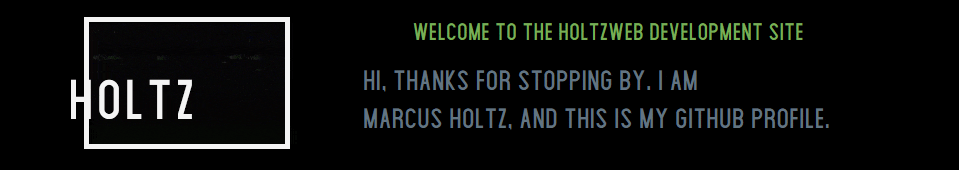

         

<pre>

┌──┤ WHOAMI ├─────────▰▰▰
│
├─▣ Systems Engineer
├─▣ General Fun Guy
├─▣ <a href="https://marcusholtz.github.io/">My Blog</a>
├─▣ I am mostly available at <a href="https://holtzweb.com/">Holtzweb</a>
│
└───────────────────────────────▰▰▰

┌──┤ SOCIAL ├─────────▰▰▰
│
├─◈ <a href="mailto:marcusaholtz+github@gmail.com">Email</a>
├─◈ <a href="https://t.me/InvalidDisk">Telegram</a>
├─◈ <a href="https://mattermost.sofree.us/sfs303/messages/@marcus">Mattermost</a>
├─◈ <a href="https://www.youtube.com/@vvwvwwvvwvwvvw">YouTube</a>
├─◈ <a href="https://www.facebook.com/DepartmentofDefense">Facebook</a>
│
└───────────────────────────────▰▰▰

┌──┤ PROJECTS ├───────▰▰▰
│
├─◈ <a href="https://github.com/MarcusHoltz/resume-generator">Dockerized Pandoc Resume Generator</a>
├─◈ <a href="https://github.com/MarcusHoltz/tmux-screen-rotate">TTY0 Tmux System Info Shuffler</a>
├─◈ <a href="https://marcusholtz.github.io/Proxmox">New Proxmox Install</a>
├─◈ <a href="https://nextcloud.sofree.us/index.php/s/6ntcY6iyDSnyLBZ">Browser Security Presentation</a>
├─◈ <a href="https://www.holtzweb.com/openwrt-presentation.html">OpenWRT Router Firmware Presenation</a>
│
└───────────────────────────────▰▰▰
</pre>

 
 

## Favorite Tech 💻

|   |   |   |   |   |
|---|---|---|---|---|
|  |  |  |  |  |
|  |  |  |  |  | 
|  |  |  |  |  |
|  |  |  |  |  |
|  |  |  |  |  |
|  |  |  |  |  |

* * * 

- 🌱 I’m always working on learning more, check back often for updated icons above.  📝
 
 
 
 

* * * 

### Visitor count

⭐️ From [Marcus Holtz](https://github.com/MarcusHoltz)
