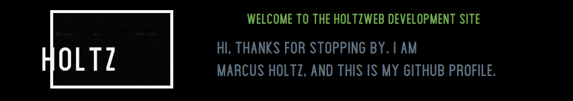

         

<pre>

┌──┤ WHOAMI ├─────────▰▰▰
│
├─▣ Systems Engineer
├─▣ Generally Fun Guy
├─▣ <a href="https://blog.holtzweb.com/">Technical projects blog</a>
├─▣ DevOps · Networking · Security · Web Dev · Administration
├─▣ More info at <a href="https://marcusholtz.com/">marcusholtz.com</a>
├─▣ Business Card:  curl marcusholtz.com/card
│
└───────────────────────────────▰▰▰

┌──┤ SOCIAL ├─────────▰▰▰
│
├─◈ <a href="mailto:contact@marcusholtz.com">Email</a>
├─◈ <a href="https://linkedin.com/in/marcus-holtz">LinkedIn</a>
├─◈ <a href="https://www.youtube.com/@vvwvwwvvwvwvvw">YouTube</a>
├─◈ <a href="https://signal.me/#p/niceripebananna.93">Signal</a>
│
└───────────────────────────────▰▰▰

┌──┤ PROJECTS ├───────▰▰▰
│
├─◉ <a href="https://github.com/MarcusHoltz/docker-gitlab-runner">Self-Hosted GitLab with CI Runners & TLS</a>
├─◉ <a href="https://github.com/MarcusHoltz/resume-generator">Auto-Updating Resume Pipeline</a>
├─◉ <a href="https://github.com/MarcusHoltz/Authentik-Traefik-MacVLAN">Authentik SSO with Traefik ForwardAuth</a>
├─◉ <a href="https://blog.holtzweb.com/posts/turn-network-services-off-after-business-hours/">After-Hours Network Lockdown: WiFi, Firewall & SSO on a Schedule</a>
├─◉ <a href="https://github.com/MarcusHoltz/astro-portfolio-theme">Astro Portfolio Theme</a>
├─◉ <a href="https://github.com/MarcusHoltz/Traefik-MacVLAN">Docker MacVLAN Traefik Analytics</a>
├─◉ <a href="https://blog.holtzweb.com/posts/unlimited-email-forwarding-address-aliases-using-cloudflare/">Cloudflare Email Routing & Aliasing</a>
├─◉ <a href="https://github.com/MarcusHoltz/proxmox-automatic-backups">ZFS Storage & Snapshot Architecture</a>
├─◉ <a href="https://github.com/MarcusHoltz/waf-smoke-test.sh">WAF Smoke Test Script</a>
├─◉ <a href="https://blog.holtzweb.com/posts/opnsense-nginx-waf-failover-with-caddy-and-traefik/">Transparent Nginx WAF on OPNsense</a>
├─◉ <a href="https://github.com/MarcusHoltz/grafana-loki-alloy-homelab-monitoring-stack">Grafana + Alloy + Loki Observability Stack</a>
├─◉ <a href="https://github.com/MarcusHoltz/ipblocklist-geofiltered-aggregator">Geofiltered IP Blocklist Aggregator</a>
├─◉ <a href="https://github.com/MarcusHoltz/vpn-over-port-53">VPN over Port 53</a>
├─◉ <a href="https://github.com/MarcusHoltz/hidden-vpn-that-looks-like-a-website">Hidden VPN That Looks Like a Website</a>
├─◉ <a href="https://github.com/MarcusHoltz/reticulum-demo">Reticulum Mesh Network Demo</a>
├─◉ <a href="https://github.com/MarcusHoltz/DNS-photo-download">Download My Photo Using DNS</a>
├─◉ <a href="https://github.com/MarcusHoltz/tor-hidden-service">Tor Hidden Service with Vanity .onion</a>
├─◉ <a href="https://blog.holtzweb.com/posts/browsers-web-browser-privacy/">Web Browser Privacy Presentation</a>
├─◉ <a href="https://www.holtzweb.com/openwrt-presentation.html">OpenWRT Router Firmware Presentation</a>
│
└───────────────────────────────▰▰▰
</pre>

 
 

## Current Technologies & Tools

|   |   |   |   |   |
|---|---|---|---|---|
|  |  |  |  |  |
|  |  |  |  |  |
|  |  |  |  |  |
|  |  |  |  |  |
|  |  |  |  |  |
|  |  |  |  |  |

* * *

- 🌱 Always working, learning, check back often for updated icons above. 📝

 
 

* * *

⭐️ From [Marcus Holtz](https://marcusholtz.com)
